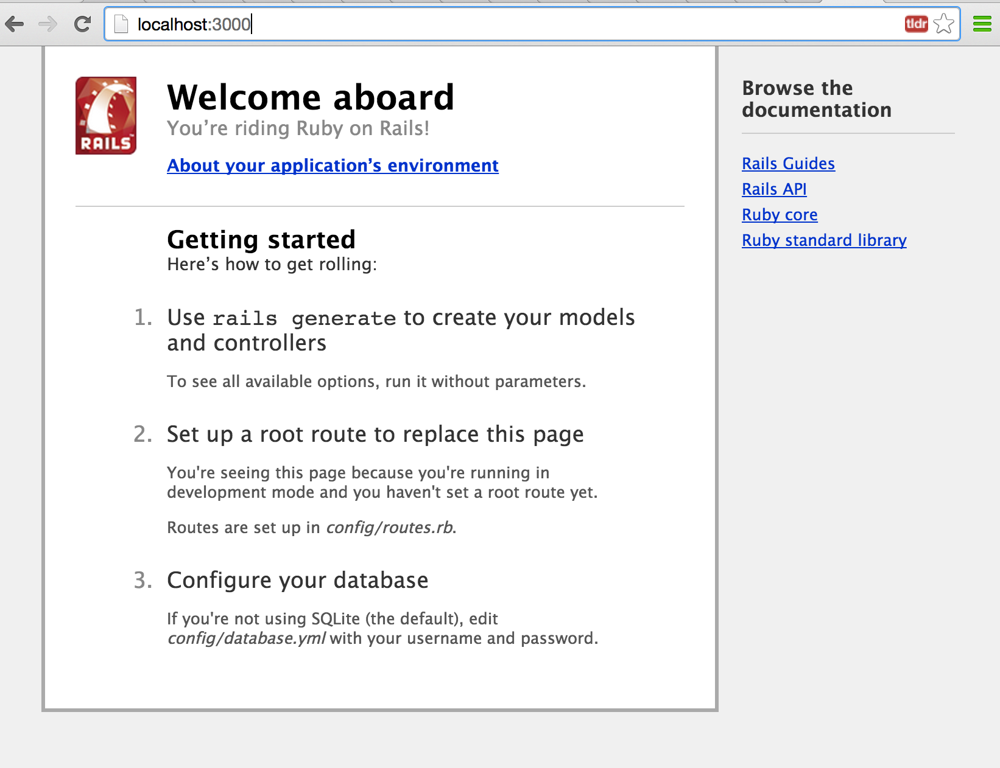

Workshop X - Cours #1
=======

Objectifs de l'atelier :

* Installer un environnement de développement pour la partie serveur (API)
* Découvrir des tutoriaux
* Réaliser un `Hello World !`

Dans ce premier atelier, nous utiliserons les technologies suivantes :

* Ruby
* Rails (un framework basé sur Ruby)
* Git

# Installation de l'environnement de travail

### Installation de Rails & Ruby

* Windows : [http://railsinstaller.org/](http://railsinstaller.org/)
* Mac : [https://github.com/tokaido/tokaidoapp](https://github.com/tokaido/tokaidoapp)

** Attention : ** il y a différentes versions de Ruby (1.9.3, 2.0.0 etc...) et de Rails. Nous utiliserons ici Ruby 2.0.0 et Rails 4.1. Votre version de rails et ruby n'est pas très grave, mais il est important d' **avoir la même version de Rails chez tous les étudiants d'un même groupe **

### Git & Github

Comme vu lors du cours d'introduction, Git sera utilisé en permanence pour **versionner** le code et **collaborer**. Cela servira aussi à vos coachs pour vous aider et vous débloquer par moment. Il est donc indispensable de commencer par ça.

Nous utiliserons **GitHub** comme serveur de Git en profitant de l'offre gratuite pour les comptes open sources.

Vous pouvez donc dès maintenant :

* Vous créer un compte sur Github
* Installer un client git si vous n'en avez pas déjà un (si vous êtes passés par railsinstaller pour Windows ça devrait être bon), par exemple celui proposé par GitHub pour [**Windows**](http://windows.github.com/) ou [**Mac**](http://mac.github.com/)
* Vous pourrez ensuite créer une __organization__ sur Github qui correspondra à votre groupe (__Workshop-Polytechnique__ dans cet exemple).

Bien qu'il existe des interfaces graphiques pour Git, nous vous conseillons d'utiliser git en ligne de commande afin de bien comprendre comment ça marche (utilisez donc git shell ou bash sous windows).
Allez maintenant faire un tour sur cette petite application interactive pour vous former à Git & Github : [http://try.github.io](http://try.github.io)

### Editeur de code

Il vous faudra un IDE ou éditeur de code tout au long de ce cours. Le plus simple sera le mieux, vous pouvez par exemple utiliser [**Sublime Text 3**](http://www.sublimetext.com/3).

### Avant de commencer

Ouvrez un Terminal / une console, et pour tester que tout est installé vous pouvez réaliser ces petits tests:

    $ git --version
    git version 1.9.3 (Apple Git-50)
    $ ruby --version
    ruby 2.0.0p481 (2014-05-08 revision 45883) [universal.x86_64-darwin14]
    $ rails --version
    Rails 4.1.6

Le test est validé si à chaque fois un numéro de version s'affiche (même si il n'est pas identique à celui présenté ici) et échoue si vous voyez une réponse du type `command not found`. Si c'est le cas assurez vous que vous n'avez pas oublié une des étapes décrites ci-dessus.

### Les proxys de l'X

NB : N'étant pas dans vos kazerts, cette partie est expérimentale. Tout retour de votre part sur ces commandes sera grandement appréciée

Pour Git, si vous êtes à l'X vous devez :

	$ git config --global http.proxy http://kuzh.polytechnique.fr:8080
	$ git config --global https.proxy http://kuzh.polytechnique.fr:8080
	
Pour les retirer (en dehors de l'X) :

	$ git config --global --unset http.proxy
	$ git config --global --unset https.proxy
	
Pour Rubygems / Bundle, à tenter :

	$ export http_proxy=http://kuzh.polytechnique.fr:8080 // (sur mac)
	$ SET http_proxy=http://kuzh.polytechnique.fr:8080    // (sur windows)

# Workshop

#### Etape 1 : Création d'un projet sur Github

* Depuis github.com, créez un nouveau **repository** avec un simple fichier Readme (comme celui là)
* Clonez ce projet sur votre machine avec la commande `git clone` avec comme argument l'url de votre repository

Vous devez donc avoir à la fin de cette étape un projet vide (contenant uniquement un fichier readme et un répertoire .git) sur votre machine.

#### Etape 2 : Génération d'une première application rails

* Depuis un terminal ouvert à la racine de votre projet, générez l'application avec la commande `rails new .` : cela va créer une application qui aura le même nom que votre dossier courant (ici Cours_1). Cette commande va générer un certain nombre de fichiers et dossiers:

        $ ls
        Gemfile      README.rdoc  bin          db           public       vendor
        Gemfile.lock Rakefile     config       lib          test
        README.md    app          config.ru    log          tmp

* Vous pouvez ensuite ouvrir le dossier en entier avec Sublime Text par exemple pour voir ces mêmes fichiers et dossiers.
* Enfin, vous allez lancer votre serveur rails en local avec la commande `rails server` ou `rails s` dans sa version courte (toujours depuis la racine de votre projet). Allez ensuite sur `http://localhost:3000` avec votre navigateur. Vous devez obtenir ça :

#### Etape 3 : Création d'un Hello World

Comme le message de Rails nous y invite, nous allons créer 3 éléments pour réaliser notre Hello World

* Création d'un controller : je demande à rails de générer un controller qui s'appelle "Home" avec une méthode "Index".

        $ rails g controller home index
        create  app/controllers/home_controller.rb
        route  get 'home/index'
        invoke  erb
        create    app/views/home
        create    app/views/home/index.html.erb
        invoke  test_unit
        create    test/controllers/home_controller_test.rb
        invoke  helper
        create    app/helpers/home_helper.rb
        invoke    test_unit
        create      test/helpers/home_helper_test.rb
        invoke  assets
        invoke    coffee
        create      app/assets/javascripts/home.js.coffee
        invoke    scss
        create      app/assets/stylesheets/home.css.scss

Comme on peu le voir en dessous, cette commande va générer un certain nombre de dossiers et fichiers dont 2 nous intéressent particulièrement : le controller `app/controllers/home_controller.rb` et la vue correspondante `app/views/home/index.html.erb`.

* Il faut ensuite créer une **route** comme nous invite rails, qui va rediriger l'adresse http://localhost:3000/ (notre route "root" sans mauvais jeux de mots) vers la vue correspondante. Pour ce faire, ajoutez la ligne `root 'home#index'` au fichier `config/routes.rb`

On peut ensuite voir ceci en allant sur notre adresse [http://localhost:3000](http://localhost:3000)

* Vous pouvez maintenant modifier la vue correspondante pour obtenir un (joli) `Hello World` à la place de ce `Home#index` en éditant le fichier `index.html.erb`

#### Etape 4 : Push du projet sur Github

* Vous allez maintenant **commiter** votre code et le **pusher** sur Github

        $ git add -A
        $ git commit -m 'mon tout premier commit'
        $ git push

Si vous retournez sur github.com dans votre repository, vous verrez tous les fichiers que vous avez créé depuis le clonage de votre projet.

Bravo, vous avez réussi !

# Ressources

#### Tutoriaux

Le tutoriel le plus simple et complet est la documentation officielle de Rails : [http://guides.rubyonrails.org/getting_started.html
](http://guides.rubyonrails.org/getting_started.html)
Nous vous conseillons de passer du temps dessus arpès avoir suivi ce premier atelier

